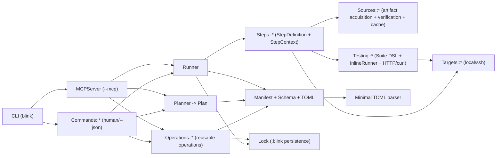

# Deep Research Report on the Blink CI Tool

## Executive summary

Enabled connector(s): **github**. fileciteturn8file0L1-L1

Blink is a Ruby-based, manifest-driven CLI intended for **deploy**, **verify**, **rollback**, and **reporting** workflows defined in `blink.toml`, with both human-friendly and machine-friendly (`--json`) outputs. fileciteturn57file0L1-L1 Blink’s core strengths are (a) a clear conceptual split between **planning** (Planner → Plan) and **execution** (Runner → Steps), (b) a compact, explicit **target/source abstraction**, and (c) a first-party **agent/MCP tool surface** (`--mcp`) that can drive the same primitives programmatically. fileciteturn57file0L1-L1 fileciteturn71file0L1-L1 fileciteturn31file0L1-L1 fileciteturn96file0L1-L1

The most leverage for “leaner and less redundant” is concentrated in four areas:

Blink currently repeats **CLI option parsing**, **JSON response formatting**, **error handling**, and **stdout capture/ANSI stripping** across many commands (deploy/build/rollback/etc.) and again inside the MCP server tool handlers. fileciteturn70file0L1-L1 fileciteturn66file0L1-L1 fileciteturn78file0L1-L1 fileciteturn96file0L1-L1 Refactoring into a shared “command kernel” plus shared “operation result envelopes” would cut duplication materially while improving correctness and consistency.

Blink’s `.blink/` persistence layer writes multiple shared JSON files without obvious file locking. Combined with the **parallel deploy** feature (threads per priority group), this raises a realistic risk of state corruption or lost updates under concurrent writes. fileciteturn70file0L1-L1 fileciteturn93file0L1-L1 This should be treated as a top-priority correctness/safety fix.

Blink’s current MCP server is “MCP-style JSON-RPC” and implements `tools/list` + `tools/call`, but it double-serializes tool results into a single `text` content block (JSON inside JSON) and does not attach `outputSchema` or `structuredContent`—features explicitly supported by the MCP schema and strongly beneficial for AI clients. fileciteturn96file0L1-L1 citeturn47view0

Blink already has the ingredients for an Ansible-like “idempotent operations engine” (steps, plan, state, verification), but it does not yet make **idempotency**, **changed/no-op**, **check mode**, and **typed outputs** first-class across all steps and transports. Ansible’s module guidance explicitly expects idempotency and JSON return data; aligning Blink’s step contracts in that direction would improve repeatability and AI automation reliability. citeturn45search2 fileciteturn36file0L1-L1 fileciteturn93file0L1-L1

The recommended direction is to converge the CLI/MCP/automation surfaces onto one semantic nucleus:

A single internal **Operation API** producing a stable **structured result model** (Plan, RunResult, StepResult, ArtifactRef, Diagnostics), with:  
- consistent `success/isError`, `summary`, `next_steps`, and `structuredContent` for AI, citeturn47view0  
- explicit idempotency/change reporting per step/action, inspired by Ansible expectations, citeturn45search2  
- an execution model that mirrors the “plan then apply” pattern used in infrastructure tools (Blink already has this shape; Terraform’s docs are a useful reference point for why this is valuable in automation). citeturn46search0turn46search1 fileciteturn71file0L1-L1

## Current implementation overview

### What Blink ships today

The README describes Blink as a declarative CLI driven by `blink.toml`, with an engine for manifest validation/planning, deploy/rollback pipelines, local+SSH targets, artifact fetching (local build, GitHub release, URL, containerized build), verification suites (Ruby DSL and inline tests), persisted `.blink/` state/history/artifact metadata, static report generation, and an MCP mode behind `--mcp`. fileciteturn57file0L1-L1

The repository is organized as a “single library” with explicit require ordering in `lib/blink.rb` (core → targets → sources → steps → testing → operations → runner/planner → commands → CLI, with MCP loaded lazily). fileciteturn87file0L1-L1 The Gemfile sets Ruby `>= 3.1` and includes only development dependencies (Rubocop, rubocop-performance, rspec), with no listed runtime gems. fileciteturn103file0L1-L1

### Architecture at a glance



This diagram matches the require graph and the class-level responsibilities visible in the codebase. fileciteturn87file0L1-L1

### Core primitives and data models

Manifest, schema, and includes: `Blink::Manifest` loads `blink.toml` (via a minimal TOML parser), validates via `Blink::Schema`, supports `blink.includes`, and loads an `.env` file present in the manifest directory. fileciteturn57file0L1-L1 fileciteturn95file0L1-L1 fileciteturn69file0L1-L1 fileciteturn19file0L1-L1

Planning: `Blink::Planner` builds a `Blink::Plan` that contains resolved step sequence, rollback steps, security posture and warnings/blockers, and a deterministic `config_hash` computed from resolved config. fileciteturn32file0L1-L1 fileciteturn73file0L1-L1 The planner is tested for deterministic hashing and security warnings (e.g., insecure HTTP URL sources) in `test/planner_test.rb`. fileciteturn98file0L1-L1

Execution: `Blink::Runner` coordinates pipeline execution and rollback behavior and records run history via `Blink::Lock`. fileciteturn31file0L1-L1 fileciteturn93file0L1-L1 Execution is built from step classes that self-describe via `StepDefinition` metadata and can validate config. fileciteturn33file0L1-L1

Persistence: `Blink::Lock` writes history entries and updates `.blink/state/current.json` and `.blink/state/recent_runs.json` and per-run `.blink/history/<run_id>.json`, and computes artifact metadata (sha256, signature info, HTTP validators, etc.). fileciteturn93file0L1-L1 The README documents this `.blink/` layout. fileciteturn57file0L1-L1

Targets: Two target types exist: local and SSH targets. fileciteturn57file0L1-L1 fileciteturn38file0L1-L1 fileciteturn39file0L1-L1 Targets run commands (`run`, `capture`), upload files, and in SSH mode also support sessions and scripting. fileciteturn39file0L1-L1

Sources: Artifact acquisition is implemented for `containerized_local_build`, `local_build`, `github_release`, and `url`, with cache and optional integrity/signature verification. fileciteturn57file0L1-L1 fileciteturn69file0L1-L1 fileciteturn51file0L1-L1 fileciteturn41file0L1-L1 fileciteturn40file0L1-L1 fileciteturn49file0L1-L1

Verification: Blink provides both Ruby test suites (Suite DSL → Runner → Reporter) and inline tests declared in TOML (InlineRunner supports `api/http`, `shell`, `mcp`, `ui`, `script`). fileciteturn90file0L1-L1 fileciteturn91file0L1-L1 fileciteturn92file0L1-L1 fileciteturn88file0L1-L1 Inline HTTP checks execute curl on the chosen target to validate the remote loopback interface. fileciteturn89file0L1-L1

Operations and commands: Many “read” and “control-plane” actions are implemented in `Blink::Operations` (status, doctor, logs, restart, ps, state, history, report, test execution) and then exposed via CLI command wrappers (with optional JSON output). fileciteturn46file0L1-L1 fileciteturn76file0L1-L1 fileciteturn75file0L1-L1

MCP mode: The MCP server is a JSON-RPC server over stdio that implements `initialize`, `tools/list`, and `tools/call`, and exposes tools like `blink_plan`, `blink_deploy`, etc. fileciteturn96file0L1-L1

## Detailed findings: hotspots and redundancy

### High-impact hotspots

Parallel deploy + shared state writes is unsafe by default. `blink deploy` can deploy all services and execute services at the same priority in parallel threads. fileciteturn70file0L1-L1 Each service run records `.blink` state/history via `Lock.persist`, which writes shared JSON files (`current.json`, `recent_runs.json`) with no file locks. fileciteturn93file0L1-L1 This combination risks write races, truncated JSON, and lost updates in real use (especially in CI or when multiple operators run Blink simultaneously).

CLI commands repeatedly reimplement: argument parsing, `--json` envelopes, rescue patterns, and ANSI-stripping output capture. This pattern is visible in deploy/build/rollback/status/logs/etc. fileciteturn70file0L1-L1 fileciteturn66file0L1-L1 fileciteturn78file0L1-L1 fileciteturn42file0L1-L1

MCP server duplicates “command semantics” and double-serializes results. Tool handlers return a JSON string embedded inside a `text` content block returned to the MCP client. fileciteturn96file0L1-L1 The MCP schema supports returning structured tool results via `structuredContent`, with `outputSchema` declared per tool, and recommends tool-level errors be returned as `isError: true` in the result object rather than as protocol-level errors. citeturn48view0

TLS defaults: multiple subsystems use `curl -k` / `curl -sk`, which disables TLS verification. This appears in the deploy health check step and in testing HTTP helper; Operations health checks also do curl-based checks. fileciteturn24file0L1-L1 fileciteturn89file0L1-L1 fileciteturn46file0L1-L1 This is acceptable as an explicit opt-in but risky as a global default for “CI tool” usage.

Schema/type duplication and drift risk: `Blink::Schema` hard-codes known steps, target types, source types, and inline test types. fileciteturn69file0L1-L1 Meanwhile, steps and sources are also registered/instantiated through separate registries (`Blink::Steps.lookup!`, `Blink::Sources.build`, and `StepDefinition` metadata). fileciteturn33file0L1-L1 fileciteturn21file0L1-L1 This increases the risk of “schema says no, runtime says yes” or vice versa as features evolve.

Inconsistent test framework dependency: The Gemfile includes `rspec` as a development dependency, but the test suite uses Minitest (`minitest/autorun`) and Rake::TestTask patterns. fileciteturn103file0L1-L1 fileciteturn86file0L1-L1 fileciteturn97file0L1-L1 This is minor but is a clear redundancy signal.

### File-level redundancy and issue map

The table below focuses on “where duplication/complexity lives” and “what kind of refactor reduces it.”

| File / component | Hotspot type | Concrete redundancy / complexity | Consequence | Lean refactor recommendation |
|---|---|---|---|---|
| `lib/blink/commands/deploy.rb` fileciteturn70file0L1-L1 | Duplication + correctness | Manual flag parsing; repeated `capture_output`; repeated JSON response shaping; parallel threads while persisting state | Harder to maintain; risk of `.blink` races when parallel deploy is used | Introduce `Commands::Base`; centralize option parsing + JSON envelope; move parallelism into Runner with persistence guardrails |
| `lib/blink/commands/build.rb` fileciteturn66file0L1-L1 | Duplication | ANSI_STRIP + capture_output duplicates deploy/rollback; repeated rescue patterns | Repeated bugfix surface | Shared `CommandRuntime.capture_output(strip_ansi: true)` and `CommandRuntime.handle_errors` |
| `lib/blink/commands/rollback.rb` fileciteturn78file0L1-L1 | Duplication | Same output capture and JSON envelope patterns | Drift in `summary/next_steps` conventions | Factor common “result-to-response” mapping used by build/deploy/rollback |
| `lib/blink/mcp_server.rb` fileciteturn96file0L1-L1 | Duplication + protocol semantics | Reimplements tool dispatch, response envelope, output capture; returns JSON-in-text; tool errors sometimes mapped to JSON-RPC error response | AI clients must parse nested JSON; harder to enforce stable schemas; mismatch with MCP structured result model | Return MCP `structuredContent` + `outputSchema`; adopt `ToolAnnotations` hints (idempotent/destructive); use MCP task/progress patterns for long ops |
| `lib/blink/lock.rb` fileciteturn93file0L1-L1 | Correctness + state | Writes multiple shared JSON files without locks; merge/update patterns are non-transactional | Race conditions; partial writes; inconsistent current state | Implement atomic writes + file locking; consider per-service state shards; make “update current” transactional |
| `lib/blink/schema.rb` fileciteturn69file0L1-L1 | Duplication + drift risk | Hard-coded `KNOWN_*` lists duplicating registries; step validation + special-cases elsewhere | Requires multiple edits per new step/source/test | Derive allowed steps/sources/tests from registries; keep Schema for structural validation but query runtime metadata |
| `lib/blink/testing/http.rb` fileciteturn89file0L1-L1 | Security + duplication | curl command building; `-sk` disables TLS checks by default | Insecure default; duplicates curl logic elsewhere | Create a single HTTP adapter with explicit `tls.verify` default true; share with health_check + ops |
| `lib/blink/steps/health_check.rb` fileciteturn24file0L1-L1 | Security | `curl -sfk` | Insecure default | Add `tls_insecure` flag (default false); switch to verified TLS by default |
| `lib/blink/operations.rb` fileciteturn46file0L1-L1 | Duplication | Duplicates health check curl behavior and HTTP-version flag logic; overlaps with step health_check | Multiple “health semantics” | Move health evaluation into a single module reused consistently (step + ops) |
| `lib/blink/targets/local_target.rb` fileciteturn38file0L1-L1 | API clarity | Raises `SSHError` even for local execution pathways | Confusing error handling; “SSH error” messages for local failures | Introduce `TargetError` hierarchy; map local/ssh failures appropriately |
| `Gemfile` + tests fileciteturn103file0L1-L1 fileciteturn97file0L1-L1 | Redundant dependency | `rspec` included, tests use Minitest | Unused dependency | Either drop `rspec` or migrate tests consistently |

## Prioritized refactor roadmap and migration plan

### Refactor roadmap with effort/risk

Effort estimates are relative and assume Ruby proficiency, no constraint on tooling, and an intent to keep `blink.toml` backward compatible.

| Priority | Initiative | What changes | Effort | Risk | Why it matters |
|---|---|---|---|---|---|
| P0 | Make `.blink` persistence safe under concurrency | Add atomic write + `flock` around updates to `current.json` and `recent_runs.json`; optionally shard per service to avoid write contention | M | Med | Prevents corruption/lost updates when parallel deploy runs or multiple Blink processes operate concurrently fileciteturn70file0L1-L1 fileciteturn93file0L1-L1 |
| P0 | Unify CLI command plumbing | Introduce `Commands::Base` with OptionParser, standardized JSON/human output, and shared exception-to-response mapping | M | Low | Removes repeated parsing/envelope logic across many commands fileciteturn70file0L1-L1 fileciteturn66file0L1-L1 fileciteturn78file0L1-L1 |
| P0 | MCP server: structured results + outputSchema | Add `outputSchema` to tools; return `structuredContent` instead of JSON-in-text; report tool errors using `isError` | M | Med | Makes MCP responses reliably machine-parseable and aligned with MCP schema guidance fileciteturn96file0L1-L1 citeturn48view0 |
| P1 | Centralize HTTP semantics + TLS policy | Replace ad-hoc curl usage with a shared HTTP adapter; set TLS verification default true; allow opt-out per check | M | Med | Security posture becomes predictable; removes duplicated curl logic across steps/ops/testing fileciteturn24file0L1-L1 fileciteturn89file0L1-L1 fileciteturn46file0L1-L1 |
| P1 | Registry-driven schema (reduce drift) | Generate allowed step/source/test lists from registries and StepDefinition metadata; keep Schema as “shape validator” | M | Low–Med | Removes duplication between Schema constants and runtime registries fileciteturn69file0L1-L1 fileciteturn33file0L1-L1 |
| P2 | Refactor `Sources::Base` responsibilities | Split caching/fingerprint/verification into modules; shared download helpers reused by url/github_release | L | Med | Reduces complexity and makes sources easier to extend safely fileciteturn40file0L1-L1 fileciteturn49file0L1-L1 |
| P2 | Establish an explicit plugin model | Formalize how new steps/sources load (gem-based or `blink/plugins/*.rb`), with schema discovery | L | Med–High | Improves extensibility and avoids “fork to add a step” without destabilizing core fileciteturn69file0L1-L1 fileciteturn33file0L1-L1 |
| P3 | Testing stack cleanup | Decide on Minitest vs RSpec; remove unused dependency; add MCP integration tests | S–M | Low | Removes tooling ambiguity; strengthens CI confidence fileciteturn103file0L1-L1 fileciteturn97file0L1-L1 |

### Concrete refactor patterns that remove duplication

Shared command base: Commands repeatedly implement the same shape: parse args → do work → format JSON or human → rescue errors. fileciteturn70file0L1-L1 fileciteturn75file0L1-L1 A base class can standardize this.

Example skeleton (runnable Ruby; intended as a template):

```ruby
# lib/blink/commands/base.rb
require "optparse"
require "json"

module Blink
  module Commands
    class Base
      def initialize(argv)
        @argv = argv.dup
        @json = false
      end

      def run
        parse!
        payload = execute
        render_success(payload)
      rescue Manifest::Error => e
        render_error(e.message, code: 1)
      rescue SSHError => e
        render_error("Target error: #{e.message}", code: 1)
      end

      private

      def parse!
        OptionParser.new do |opts|
          opts.on("--json") { @json = true }
          # subclasses add flags via add_options(opts)
          add_options(opts)
        end.parse!(@argv)
      end

      def add_options(_opts); end
      def execute; raise NotImplementedError; end

      def render_success(details)
        if @json
          puts Response.dump(success: true, summary: summary(details), details: details, next_steps: next_steps(details))
        else
          render_human(details)
        end
      end

      def render_error(message, code:)
        if @json
          puts Response.dump(success: false, summary: message, details: {}, next_steps: ["Fix the error and retry."])
          exit code
        end
        Output.fatal(message)
      end

      def summary(_details) = "ok"
      def next_steps(_details) = []
      def render_human(_details) = nil
    end
  end
end
```

This refactor collapses dozens of repeated patterns visible across command files. fileciteturn64file0L1-L1 fileciteturn70file0L1-L1 fileciteturn66file0L1-L1 fileciteturn78file0L1-L1

Single output capture helper: Deploy/build/rollback and MCP server all implement ANSI stripping and stdout capture. fileciteturn70file0L1-L1 fileciteturn66file0L1-L1 fileciteturn78file0L1-L1 fileciteturn96file0L1-L1 Move this into `Blink::Runtime.capture_output`.

Safe persistence primitives: `Lock.write_json` writes directly to destination paths. fileciteturn93file0L1-L1 Replace with `write_json_atomic(path, payload)` (write temp file + fsync + rename) and wrap update sequences in `File.open(lockfile).flock(File::LOCK_EX)`.

### Migration plan for existing users

This plan assumes `blink.toml` remains version `"1"` and only additive keys are introduced, which is consistent with current Schema validation patterns and README expectations. fileciteturn57file0L1-L1 fileciteturn69file0L1-L1

Phase one: “No breaking changes”  
- Preserve existing command names and `--json` outputs, but standardize fields gradually (ensure `success`, `summary`, `details`, `next_steps` are consistently present—today this is mostly true). fileciteturn48file0L1-L1 fileciteturn67file0L1-L1  
- Introduce file-locking and atomic writes in `.blink/` with no changes to file names or the JSON shape. This primarily changes durability, not semantics. fileciteturn93file0L1-L1  
- MCP: add `structuredContent` in addition to the existing JSON-in-text payload for a deprecation window (clients can migrate without breaking). fileciteturn96file0L1-L1 citeturn48view0

Phase two: “Semantic tightening and security defaults”  
- Switch TLS verification defaults to “verify by default,” requiring explicit opt-in for insecure `-k` mode in health checks and testing HTTP. Introduce new config keys like `health_check.tls_insecure = true` and `verify.tests.*.tls_insecure = true` with Schema support. fileciteturn24file0L1-L1 fileciteturn89file0L1-L1 fileciteturn69file0L1-L1  
- Emit warnings (not blockers) for a release cycle before enforcing stricter behavior.

Phase three: “Extensibility and plugin ecosystem”  
- Add optional plugin loading; keep built-ins stable.  
- Extend Schema discovery to include plugin-provided metadata automatically rather than duplicating lists. fileciteturn69file0L1-L1 fileciteturn33file0L1-L1

## AI-friendly semantic model for orchestration

### Why Blink’s semantics should converge on plan/apply + typed results

Blink already has a “plan then execute” mental model: `blink plan` yields a structured plan with blockers/warnings and a deterministic config hash, and `blink deploy` executes the pipeline and persists results. fileciteturn71file0L1-L1 fileciteturn73file0L1-L1 fileciteturn93file0L1-L1 This mirrors the rationale behind tools like Terraform: a plan previews proposed changes, and apply executes them; in automation a saved plan provides stability across time/machines. citeturn46search0turn46search1turn46search2

For AI-driven orchestration, the critical requirement is that every operation returns:

A stable structured payload (`structuredContent`) with a declared schema (`outputSchema`), so an agent does not need to scrape text. The MCP schema explicitly supports `outputSchema` for tools and returning `structuredContent` in tool results. citeturn48view0

A small, safe natural-language `summary` plus `next_steps`, since LLM agents work best with concise action guidance alongside structured data (Blink already produces this in MCP tool handlers, but in nested JSON). fileciteturn96file0L1-L1

Explicit idempotency/destructiveness hints. MCP tool metadata supports `ToolAnnotations` such as `idempotentHint` and `destructiveHint`. citeturn48view0

### Proposed “semantic nucleus” for Blink

Define a first-class internal model (Ruby structs/classes) that every interface layer uses:

OperationPlan  
- `operation`: `build|deploy|test|rollback|status|doctor|logs|report`  
- `service` and `target` selection  
- `pipeline`: ordered steps, each with a StepDefinition snapshot and resolved config  
- `rollback_pipeline`  
- `security`: transport/integrity/signature posture  
- `config_hash` (already) fileciteturn73file0L1-L1

OperationResult  
- `success` / `isError`  
- `summary`  
- `started_at`, `completed_at`, `duration`  
- `changed` (crucial for idempotency)  
- `artifacts`: list of ArtifactRef outputs (sha256, provenance, signature info) fileciteturn93file0L1-L1  
- `step_results`: each step returns `status`, `changed`, `stdout/stderr`, and a minimal structured `output` map.

This is aligned with Ansible’s philosophy that modules return JSON and should be idempotent (detect desired state and avoid changes). citeturn45search2

### Ansible-like compatibility: where Blink matches and where it diverges

Ansible compatibility should be framed as “Ansible-like operational safety and semantics,” not “identical configuration management.” Blink is service/pipeline centric; Ansible is inventory/task centric. fileciteturn57file0L1-L1 citeturn45search2

| Concept | Blink today | Ansible framing | Practical guidance |
|---|---|---|---|
| Desired state | “Pipeline ran successfully” + persisted run history/state fileciteturn93file0L1-L1 | Modules define desired state and report changed/no-op citeturn45search2 | Add `changed` and `idempotent` per step; let plan show “no-op” prediction |
| Execution unit | Step in pipeline fileciteturn33file0L1-L1 | Module/task | Treat each step as a typed module with config schema + idempotency contract |
| Inventory | Targets table + per-service target selection fileciteturn69file0L1-L1 | Inventory groups/hosts | Add optional “target selectors” (tags/labels) later; keep explicit names now |
| Check/dry-run | `--dry-run` for deploy/build/rollback; plan exists fileciteturn70file0L1-L1 fileciteturn71file0L1-L1 | `--check` and `--diff` patterns | Standardize dry-run semantics per step (predict changes); add “diff hooks” where possible |
| Verification | Inline tests + Ruby suites fileciteturn88file0L1-L1 fileciteturn90file0L1-L1 | Ad-hoc validation tasks + asserts | Blink is strong here; stabilize test result schema for AI and CI |

### AI inference hooks: what to add without bloating Blink

Expose a “semantic trace” stream: each step emits start/end events with a stable event schema, enabling both CLI progress and AI/tool progress reporting. MCP supports progress tokens and notifications/progress. citeturn48view0

Add a “capability catalog” tool: Blink already has `blink_steps`; extend it to include structured `idempotent`, `destructive`, and `reads/writes` metadata for each step via `StepDefinition` and MCP `ToolAnnotations`. fileciteturn33file0L1-L1 citeturn48view0

Make the config hash actionable: when `config_hash` matches `last_deploy.config_hash` and artifact hash matches, Blink can treat deploy as no-op (or at least warn strongly that nothing materially changed). Plan already computes stable hashing; Lock persists config hash. fileciteturn73file0L1-L1 fileciteturn93file0L1-L1

## MCP server evaluation and improvement plan

### Current MCP server behavior

Blink’s MCP server:

Runs JSON-RPC 2.0 over stdio, reading one JSON object per line and writing responses per line. fileciteturn96file0L1-L1  
Implements `initialize`, `tools/list`, and `tools/call` dispatch. fileciteturn96file0L1-L1  
Defines a fixed tool list including build/deploy/test/status/logs/restart/rollback/doctor/etc, each with an `inputSchema` similar to JSON Schema object definitions. fileciteturn96file0L1-L1  
Returns tool results as `{ content: [{ type: "text", text: "<JSON string>" }] }`, where the text itself is JSON with `success`, `summary`, `suggested_next_step`, and `data`. fileciteturn96file0L1-L1

It is largely aligned with JSON-RPC requirements (result vs error members, standard error codes), but its tool result payload is not maximally interoperable or AI-friendly due to double serialization. citeturn45search0turn45search1 fileciteturn96file0L1-L1

### MCP spec alignment gaps (and why they matter)

The MCP schema defines:

`CallToolResult` includes `content` and *optionally* `structuredContent`, plus `isError`. Also, if a tool defines an `outputSchema`, `structuredContent` “SHOULD” conform to it. citeturn48view0  
Tool errors “SHOULD” be reported inside the result object with `isError = true`, so the LLM can see the error and self-correct; protocol-level errors should be reserved for exceptional conditions like unknown tools. citeturn48view0  
Tools can include annotations like `idempotentHint` and `destructiveHint`. citeturn48view0

Blink currently:  
- does not declare `outputSchema`, fileciteturn96file0L1-L1  
- does not use `structuredContent`, fileciteturn96file0L1-L1  
- encodes operational failures sometimes as JSON-RPC errors rather than `CallToolResult.isError`, depending on where the exception is raised. fileciteturn96file0L1-L1

### Improvement plan

Implement structured tool results (highest value, low conceptual risk).  
For each MCP tool:
- Add an `outputSchema` describing the structured payload.  
- Return an MCP `CallToolResult` with both:
  - `content`: short human-readable text (optional but often useful), and
  - `structuredContent`: the actual machine-parseable object. citeturn48view0

Example direction (shape, not exact code):

```json
{
  "jsonrpc": "2.0",
  "id": 12,
  "result": {
    "content": [{ "type": "text", "text": "Deploy succeeded: app@v1.2.3" }],
    "structuredContent": {
      "success": true,
      "summary": "Deployed app to prod",
      "next_steps": ["Run blink_test for app"],
      "data": { "...": "..." }
    },
    "isError": false
  }
}
```

Adopt tool annotations to help LLM-side planning.  
Mark:
- `blink_deploy` and `blink_rollback` as `destructiveHint: true`,  
- `blink_plan` and `blink_steps` as `readOnlyHint: true`,  
- `blink_status`, `blink_state`, `blink_history` as `idempotentHint: true`. citeturn48view0

Introduce progress + task support for long-running operations.  
The MCP schema supports progress tokens and task-related notifications. citeturn48view0 Blink already calls out MCP timeouts for long builds and introduced a `skip_build` option for deploy (changelog), which is a symptom of missing “long job” support. fileciteturn60file0L1-L1  
A robust plan is to:
- make `blink_build` and `blink_deploy` optionally return a task handle immediately,  
- emit progress notifications,  
- allow cancellation and later retrieval of results via tasks endpoints.

Transport framing hardening.  
Line-delimited JSON is convenient but brittle: JSON can contain newlines, and not all MCP clients frame messages this way. The MCP specification includes a “Transports” section, and the schema is explicitly JSON-RPC-based. citeturn47view0  
A pragmatic approach:
- keep line-delimited mode as a legacy “compat layer,”  
- add support for a more standard framing protocol (e.g., Content-Length style) depending on MCP transport guidance,  
- gate by a flag: `blink --mcp --transport stdio-lines|stdio-lsp`.

Security hygiene for agent mode.  
MCP server logs tool args to stderr. fileciteturn96file0L1-L1 If tool arguments can include secrets (headers/tokens), sanitize before logging. Additionally, ensure `structuredContent` never echoes secrets by default.

## Concrete examples, templates, and best-practice setups

### Common `blink.toml` templates

Systemd-style service deploy to SSH target (artifact + install + health + verify). This follows the README’s default scaffold, but targets SSH and adds provisioning. fileciteturn57file0L1-L1 fileciteturn29file0L1-L1 fileciteturn36file0L1-L1 fileciteturn24file0L1-L1

```toml
[blink]
version = "1"

[targets.prod]
type = "ssh"
host = "prod.example.com"
user = "deploy"
base = "/srv/myapp"

[services.myapp]
description = "MyApp API"
port = "8080"

[services.myapp.source]
type = "github_release"
repo = "owner/myapp"
asset = "myapp-linux-amd64"
token_env = "GITHUB_TOKEN"
checksum_asset = "checksums.txt"

[services.myapp.deploy]
target = "prod"
pipeline = ["fetch_artifact", "provision", "stop", "backup", "install", "start", "health_check", "verify"]
rollback_pipeline = ["stop", "rollback", "start"]

[services.myapp.provision]
dirs = ["var", "etc"]

[services.myapp.provision.env_file]
path = "etc/myapp.env"
seed = { RACK_ENV = "production" }
always_update = ["RACK_ENV"]

[services.myapp.install]
dest = "/srv/myapp/bin/myapp"

[services.myapp.stop]
command = "sudo systemctl stop myapp"

[services.myapp.start]
command = "sudo systemctl start myapp"

[services.myapp.health_check]
url = "https://127.0.0.1:{{port}}/health"
http_version = "1.1"
```

Notes:
- `provision.env_file.always_update` exists and is designed to safely refresh selected keys each run. fileciteturn29file0L1-L1 fileciteturn60file0L1-L1  
- `github_release` can validate checksum/signature; prefer that for supply-chain hygiene. fileciteturn40file0L1-L1 fileciteturn57file0L1-L1

Docker-managed service on SSH target. Blink has a `docker` step that can build or run containers with env/ports/volumes on the target. fileciteturn30file0L1-L1

```toml
[services.web.deploy]
target = "prod"
pipeline = ["stop", "docker", "health_check"]

[services.web.docker]
name = "web"
image = "ghcr.io/owner/web:stable"
ports = [{ host = "8080", container = "8080" }]
env = { PORT = "8080" }
```

### CLI “best practice” flows

A safe CI-ish sequence for a single service:

```sh
bin/blink validate --json
bin/blink plan myapp --json
bin/blink build myapp --json
bin/blink deploy myapp --json
bin/blink test myapp --json
bin/blink report generate --format json --json
```

This sequence is consistent with the README’s described workflow and the existence of these commands in CLI. fileciteturn57file0L1-L1 fileciteturn64file0L1-L1

### Recommended CI for Blink itself

Blink already has a Minitest test suite entrypoint and a Rake test task. fileciteturn86file0L1-L1 fileciteturn97file0L1-L1 A robust baseline CI should:
- run unit tests (`rake test`) across Ruby versions declared supported,  
- run Rubocop,  
- run “smoke command validations” against fixture manifests (`blink validate`, `blink plan`).

Example GitHub Actions workflow (template):

```yaml
name: blink-ci

on:
  push:
  pull_request:

jobs:
  test:
    runs-on: ubuntu-latest
    strategy:
      matrix:
        ruby: ["3.1", "3.2", "3.3"]
    steps:
      - uses: actions/checkout@v4
      - uses: ruby/setup-ruby@v1
        with:
          ruby-version: ${{ matrix.ruby }}
          bundler-cache: true
      - name: Unit tests
        run: bundle exec rake test
      - name: Rubocop
        run: bundle exec rubocop
      - name: CLI smoke (validate + plan)
        run: |
          bin/blink validate --json
          bin/blink plan fixture --json
```

This aligns with the repo’s existing toolchain (Bundler + Rake::TestTask + Rubocop). fileciteturn86file0L1-L1 fileciteturn103file0L1-L1

Test additions most worth doing next:

MCP server integration tests: simulate stdin/stdout for `initialize`, `tools/list`, and a tool call. This is currently untested, while MCP is a major interface surface. fileciteturn96file0L1-L1

Concurrency tests for Lock: spawn threads or processes that record runs simultaneously and assert `.blink/state/current.json` remains valid JSON and consistent. The presence of threaded deploy makes this especially important. fileciteturn70file0L1-L1 fileciteturn93file0L1-L1

Security-default tests: ensure TLS verification defaults are not silently disabled (today `-k` is widespread). fileciteturn89file0L1-L1 fileciteturn24file0L1-L1

### AI-assisted workflow examples via MCP

MCP call structure is JSON-RPC 2.0. JSON-RPC requires `jsonrpc: "2.0"`, request ids, and either `result` or `error` in responses. citeturn45search0turn45search1 MCP defines `tools/list`, `tools/call`, and `CallToolResult` with optional structured content. citeturn48view0

List tools:

```json
{"jsonrpc":"2.0","id":1,"method":"tools/list","params":{}}
```

Call a tool (plan):

```json
{"jsonrpc":"2.0","id":2,"method":"tools/call","params":{"name":"blink_plan","arguments":{"service":"myapp"}}}
```

For AI-friendliness, Blink should evolve responses toward `structuredContent` + `outputSchema` rather than returning JSON-in-text, because MCP explicitly supports structured tool outputs and output schemas. citeturn48view0 fileciteturn96file0L1-L1

## References and sources

Primary repository sources (Bare-Systems/Blink):
- README overview, feature set, `.blink` structure, command surface. fileciteturn57file0L1-L1  
- Require graph + module boundaries (`lib/blink.rb`). fileciteturn87file0L1-L1  
- CLI dispatch and command list (`lib/blink/cli.rb`). fileciteturn64file0L1-L1  
- MCP server implementation (`lib/blink/mcp_server.rb`). fileciteturn96file0L1-L1  
- Plan model + deterministic config hashing (`lib/blink/plan.rb`). fileciteturn73file0L1-L1  
- Planner + plan security posture tests (`test/planner_test.rb`). fileciteturn98file0L1-L1  
- State/history persistence (`lib/blink/lock.rb`). fileciteturn93file0L1-L1  
- Schema validation (`lib/blink/schema.rb`). fileciteturn69file0L1-L1  
- Steps and step metadata (`lib/blink/steps/base.rb` and built-in steps). fileciteturn33file0L1-L1 fileciteturn22file0L1-L1 fileciteturn30file0L1-L1  
- Testing framework and inline runner (`lib/blink/testing/*`). fileciteturn88file0L1-L1 fileciteturn91file0L1-L1  
- Deploy parallelization behavior (`lib/blink/commands/deploy.rb`). fileciteturn70file0L1-L1  
- Gemfile (Ruby constraint, dev dependencies). fileciteturn103file0L1-L1  

External primary/official sources:
- JSON-RPC 2.0 specification (request/response shape, error codes). citeturn45search0turn45search1  
- Model Context Protocol schema reference (tools/list, tools/call, CallToolResult.structuredContent, ToolAnnotations hints). citeturn48view0  
- Ansible module guidance (modules return JSON; should be idempotent). citeturn45search2  
- entity["company","HashiCorp","terraform vendor"] Terraform CLI docs: `terraform plan` and `terraform apply` (plan/apply rationale for automation). citeturn46search0turn46search1turn46search2